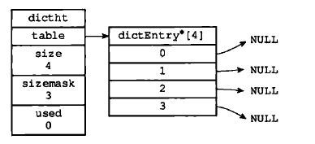
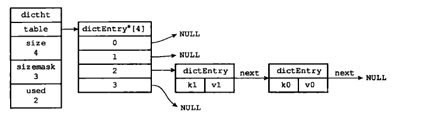

[toc]

# 字典

## 字典的实现

Redis的字典使用哈希表作为底层实现，一个哈希表里面可以有多个哈希表节点，而每个哈希表节点就保存了用字典中的一个键值对。

### 字典结构

#### 字典的哈希表结构

```c
/*
 * 哈希表
 *
 * 每个字典都使用两个哈希表，从而实现渐进式 rehash 。
 */
typedef struct dictht {
    
    // 哈希表数组
    dictEntry **table;

    // 哈希表大小
    unsigned long size;
    
    // 哈希表大小掩码，用于计算索引值
    // 总是等于 size - 1
    unsigned long sizemask;

    // 该哈希表已有节点的数量
    unsigned long used;

} dictht;
```

- table属性是一个数组，数组中的每个元素都是一个指向哈希表节点`dictEntry`结构的指针，每个`dictEntry`都保存着一个键值对。
- size属性记录了哈希表的大小，也即table的大小，而used属性则记录了哈希表目前已有的节点（键值对）的数量。
- sizemask属性的值总是等于size-1，这个属性和哈希值一起决定一个键应该放到table数组的那个索引上面。

其中概念如图:




#### 哈希表的节点

```c
/*
 * 哈希表节点
 */
typedef struct dictEntry {
    
    // 键
    void *key;

    // 值
    union {
        void *val;
        uint64_t u64;
        int64_t s64;
    } v;

    // 指向下个哈希表节点，形成链表
    struct dictEntry *next;

} dictEntry;
```

- `key`属性保存着键值对中的键，而v属性则保存着键值对中的值，其中键值对的值可以是一个指针，或者是一个`uint64_t`整数，又或者是一个`int64_t`整数。
- `next`属性是指向另一个哈希节点的指针，这个指针可以将多个哈希值相同的键值对连接在一起，一次来解决键冲突的问题。

其中概念如图:



#### 字典的结构

```c
/*
 * 字典
 */
typedef struct dict {

    // 类型特定函数
    dictType *type;

    // 私有数据
    void *privdata;

    // 哈希表
    dictht ht[2];

    // rehash 索引
    // 当 rehash 不在进行时，值为 -1
    int rehashidx; /* rehashing not in progress if rehashidx == -1 */

    // 目前正在运行的安全迭代器的数量
    int iterators; /* number of iterators currently running */

} dict;
```

- `type`属性是一个指向dictType结构的指针，每个dictType结构保存了一簇用于操作特定类型的键值对函数，Redis会为不同的字典设置不同的类型特定函数。
- `privdata`属性则保存了需要传给那些特定函数的可选参数。

```c
/*
 * 字典类型特定函数
 */
typedef struct dictType {

    // 计算哈希值的函数
    unsigned int (*hashFunction)(const void *key);

    // 复制键的函数
    void *(*keyDup)(void *privdata, const void *key);

    // 复制值的函数
    void *(*valDup)(void *privdata, const void *obj);

    // 对比键的函数
    int (*keyCompare)(void *privdata, const void *key1, const void *key2);

    // 销毁键的函数
    void (*keyDestructor)(void *privdata, void *key);
    
    // 销毁值的函数
    void (*valDestructor)(void *privdata, void *obj);

} dictType;

```

- `ht`属性是一个包含两个项的数组，数组中的每个项都是一个`dictht`哈希表，一般情况下，字典只使用`ht[0]`哈希表进行rehash时使用。
- `rehashidx`属性记录了rehash目前的仅需，如果目前没有进行rehash，那么他的值为-1。

其中概念如图:


## 哈希算法

### 哈希表初始化

```
/*
 * 创建一个新的字典
 *
 * T = O(1)
 */
dict *dictCreate(dictType *type,
        void *privDataPtr)
{
    dict *d = zmalloc(sizeof(*d));

    _dictInit(d,type,privDataPtr);

    return d;
}

/*
 * 初始化哈希表
 *
 * T = O(1)
 */
int _dictInit(dict *d, dictType *type,
        void *privDataPtr)
{
    // 初始化两个哈希表的各项属性值
    // 但暂时还不分配内存给哈希表数组
    _dictReset(&d->ht[0]);
    _dictReset(&d->ht[1]);

    // 设置类型特定函数
    d->type = type;

    // 设置私有数据
    d->privdata = privDataPtr;

    // 设置哈希表 rehash 状态
    d->rehashidx = -1;

    // 设置字典的安全迭代器数量
    d->iterators = 0;

    return DICT_OK;
}

/*
 * 重置（或初始化）给定哈希表的各项属性值
 *
 * p.s. 上面的英文注释已经过期
 *
 * T = O(1)
 */
static void _dictReset(dictht *ht)
{
    ht->table = NULL;
    ht->size = 0;
    ht->sizemask = 0;
    ht->used = 0;
}
```


### 哈希键值的插入

当要将一个新的键值对，添加到字典的时候，程序需要先更具键值对的键计算出哈希值和索引值，然后在根据索引值，将包含新键值对的哈希表节点放到哈希表数组的指定索引上面。

Redis是用的`MurmurHash2`算法计算键的哈希值，这种算法的优点在于，即使输入的是有规律的，算法任能给出一个很好的随机分布性，并且算法计算速度也很快。

```c

```


## 解决键冲突问题


## rehash


## 渐进式rehash

