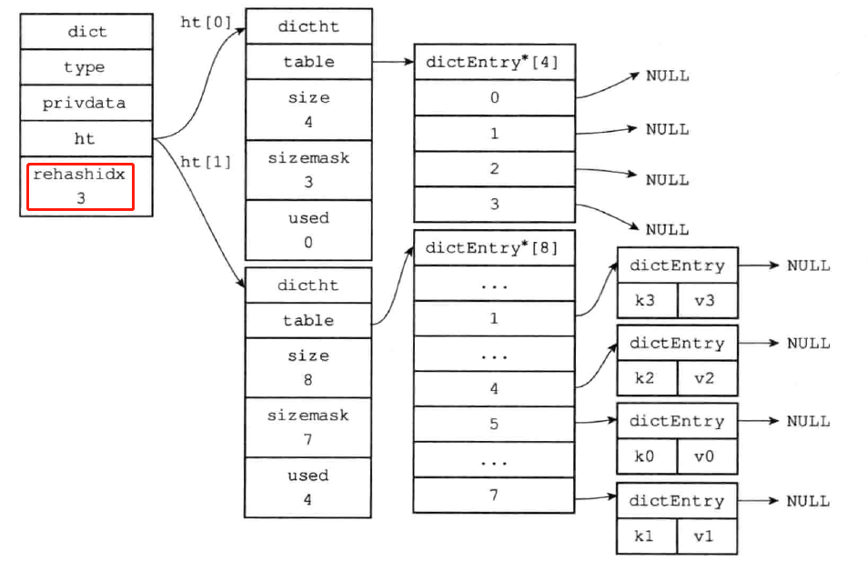

[toc]

# 字典

## 字典的实现

Redis的字典使用哈希表作为底层实现，一个哈希表里面可以有多个哈希表节点，而每个哈希表节点就保存了用字典中的一个键值对。

### 字典结构

#### 字典的哈希表结构

```c
/*
 * 哈希表
 *
 * 每个字典都使用两个哈希表，从而实现渐进式 rehash 。
 */
typedef struct dictht {
    
    // 哈希表数组
    dictEntry **table;

    // 哈希表大小
    unsigned long size;
    
    // 哈希表大小掩码，用于计算索引值
    // 总是等于 size - 1
    unsigned long sizemask;

    // 该哈希表已有节点的数量
    unsigned long used;

} dictht;
```

- table属性是一个数组，数组中的每个元素都是一个指向哈希表节点`dictEntry`结构的指针，每个`dictEntry`都保存着一个键值对。
- size属性记录了哈希表的大小，也即table的大小，而used属性则记录了哈希表目前已有的节点（键值对）的数量。
- sizemask属性的值总是等于size-1，这个属性和哈希值一起决定一个键应该放到table数组的那个索引上面。

其中概念如图:


#### 哈希表的节点

```c
/*
 * 哈希表节点
 */
typedef struct dictEntry {
    
    // 键
    void *key;

    // 值
    union {
        void *val;
        uint64_t u64;
        int64_t s64;
    } v;

    // 指向下个哈希表节点，形成链表
    struct dictEntry *next;

} dictEntry;
```

- `key`属性保存着键值对中的键，而v属性则保存着键值对中的值，其中键值对的值可以是一个指针，或者是一个`uint64_t`整数，又或者是一个`int64_t`整数。
- `next`属性是指向另一个哈希节点的指针，这个指针可以将多个哈希值相同的键值对连接在一起，一次来解决键冲突的问题。

其中概念如图:


#### 字典的结构

```c
/*
 * 字典
 */
typedef struct dict {

    // 类型特定函数
    dictType *type;

    // 私有数据
    void *privdata;

    // 哈希表
    dictht ht[2];

    // rehash 索引
    // 当 rehash 不在进行时，值为 -1
    int rehashidx; /* rehashing not in progress if rehashidx == -1 */

    // 目前正在运行的安全迭代器的数量
    int iterators; /* number of iterators currently running */

} dict;
```

- `type`属性是一个指向dictType结构的指针，每个dictType结构保存了一簇用于操作特定类型的键值对函数，Redis会为不同的字典设置不同的类型特定函数。
- `privdata`属性则保存了需要传给那些特定函数的可选参数。

```c
/*
 * 字典类型特定函数
 */
typedef struct dictType {

    // 计算哈希值的函数
    unsigned int (*hashFunction)(const void *key);

    // 复制键的函数
    void *(*keyDup)(void *privdata, const void *key);

    // 复制值的函数
    void *(*valDup)(void *privdata, const void *obj);

    // 对比键的函数
    int (*keyCompare)(void *privdata, const void *key1, const void *key2);

    // 销毁键的函数
    void (*keyDestructor)(void *privdata, void *key);
    
    // 销毁值的函数
    void (*valDestructor)(void *privdata, void *obj);

} dictType;

```

- `ht`属性是一个包含两个项的数组，数组中的每个项都是一个`dictht`哈希表，一般情况下，字典只使用`ht[0]`哈希表进行rehash时使用。
- `rehashidx`属性记录了rehash目前的仅需，如果目前没有进行rehash，那么他的值为-1。

其中概念如图:


## 哈希算法

### 哈希表初始化

```c
/*
 * 创建一个新的字典
 *
 * T = O(1)
 */
dict *dictCreate(dictType *type,
        void *privDataPtr)
{
    dict *d = zmalloc(sizeof(*d));

    _dictInit(d,type,privDataPtr);

    return d;
}

/*
 * 初始化哈希表
 *
 * T = O(1)
 */
int _dictInit(dict *d, dictType *type,
        void *privDataPtr)
{
    // 初始化两个哈希表的各项属性值
    // 但暂时还不分配内存给哈希表数组
    _dictReset(&d->ht[0]);
    _dictReset(&d->ht[1]);

    // 设置类型特定函数
    d->type = type;

    // 设置私有数据
    d->privdata = privDataPtr;

    // 设置哈希表 rehash 状态
    d->rehashidx = -1;

    // 设置字典的安全迭代器数量
    d->iterators = 0;

    return DICT_OK;
}

/*
 * 重置（或初始化）给定哈希表的各项属性值
 *
 * p.s. 上面的英文注释已经过期
 *
 * T = O(1)
 */
static void _dictReset(dictht *ht)
{
    ht->table = NULL;
    ht->size = 0;
    ht->sizemask = 0;
    ht->used = 0;
}
```


### 哈希键值的插入

当要将一个新的键值对，添加到字典的时候.

程序需要先更具键值对的键计算出哈希值和索引值.

然后在根据索引值，将包含新键值对的哈希表节点放到哈希表数组的指定索引上面。


这里简化的操作为

```c
// 计算键的哈希值
hash = dict->type->hashFunction(key);
// 计算dictEntry的索引值
idx = h & d->ht[table].sizemask;
```

Redis是用的`MurmurHash2`算法计算键的哈希值，这种算法的优点在于，即使输入的是有规律的，算法任能给出一个很好的随机分布性，并且算法计算速度也很快。

```c
/*
 * 尝试将给定键值对添加到字典中
 *
 * 只有给定键 key 不存在于字典时，添加操作才会成功
 *
 * 添加成功返回 DICT_OK ，失败返回 DICT_ERR
 *
 * 最坏 T = O(N) ，平滩 O(1) 
 */
int dictAdd(dict *d, void *key, void *val)
{
    // 尝试添加键到字典，并返回包含了这个键的新哈希节点
    // T = O(N)
    dictEntry *entry = dictAddRaw(d,key);

    // 键已存在，添加失败
    if (!entry) return DICT_ERR;

    // 键不存在，设置节点的值
    // T = O(1)
    dictSetVal(d, entry, val);

    // 添加成功
    return DICT_OK;
}

/*
 * 尝试将键插入到字典中
 *
 * 如果键已经在字典存在，那么返回 NULL
 *
 * 如果键不存在，那么程序创建新的哈希节点，
 * 将节点和键关联，并插入到字典，然后返回节点本身。
 *
 * T = O(N)
 */
dictEntry *dictAddRaw(dict *d, void *key)
{
    int index;
    dictEntry *entry;
    dictht *ht;

    // 如果条件允许的话，进行单步 rehash
    // T = O(1)
    if (dictIsRehashing(d)) _dictRehashStep(d);

    // 计算键在哈希表中的索引值
    // 如果值为 -1 ，那么表示键已经存在
    // T = O(N)
    if ((index = _dictKeyIndex(d, key)) == -1)
        return NULL;

    // T = O(1)
    /* Allocate the memory and store the new entry */
    // 如果字典正在 rehash ，那么将新键添加到 1 号哈希表
    // 否则，将新键添加到 0 号哈希表
    ht = dictIsRehashing(d) ? &d->ht[1] : &d->ht[0];
    // 为新节点分配空间
    entry = zmalloc(sizeof(*entry));
    // 将新节点插入到链表表头
    entry->next = ht->table[index];
    ht->table[index] = entry;
    // 更新哈希表已使用节点数量
    ht->used++;

    /* Set the hash entry fields. */
    // 设置新节点的键
    // T = O(1)
    dictSetKey(d, entry, key);

    return entry;
}

/* 返回可以将 key 插入到哈希表的索引位置
 * 如果 key 已经存在于哈希表，那么返回 -1
 *
 * 注意，如果字典正在进行 rehash ，那么总是返回 1 号哈希表的索引。
 * 因为在字典进行 rehash 时，新节点总是插入到 1 号哈希表。
 *
 * T = O(N)
 */
static int _dictKeyIndex(dict *d, const void *key)
{
    unsigned int h, idx, table;
    dictEntry *he;

    // 单步 rehash
    // T = O(N)
    if (_dictExpandIfNeeded(d) == DICT_ERR)
        return -1;

    // 计算 key 的哈希值
    h = dictHashKey(d, key);
    // T = O(1)
    for (table = 0; table <= 1; table++) {

        // 计算索引值
        idx = h & d->ht[table].sizemask;

        // 查找 key 是否存在
        // T = O(1)
        he = d->ht[table].table[idx];
        while(he) {
            if (dictCompareKeys(d, key, he->key))
                return -1;
            he = he->next;
        }

        // 如果运行到这里时，说明 0 号哈希表中所有节点都不包含 key
        // 如果这时 rehahs 正在进行，那么继续对 1 号哈希表进行 rehash
        if (!dictIsRehashing(d)) break;
    }

    // 返回索引值
    return idx;
}

// 计算给定键的哈希值
#define dictHashKey(d, key) (d)->type->hashFunction(key)

// 设置给定字典节点的键
#define dictSetKey(d, entry, _key_) do { \
    if ((d)->type->keyDup) \
        entry->key = (d)->type->keyDup((d)->privdata, _key_); \
    else \
        entry->key = (_key_); \
} while(0)
```


## 解决键冲突问题

当有两个或以上数量的键被分配到了哈希表数组的同一个索引上面时，我们称这些键发生了冲突。

Redis的哈希表使用链地址法来解决键冲突，每个哈希表节点都有一个`next`指针，多个哈希表节点可以用`next`指针构成一个单项链表，被分配到同一个索引上的多个节点可以用这个单项链表连接起来，这就解决了键冲突问题。

如图所示：


如果发生了冲突，则插入链表下一位。


## rehash

随着操作的不断执行，哈希表保存的键值对会逐渐增多或者减少，为了让哈希表的负载因子维持在一个合理的范围之内，当哈希表保存的键值对数量太多或者太少时，程序需要对哈希的大小进行相应的拓展或者收缩。

扩展和收缩哈希表的工作可以通过rehash操作来完成，Redis对字典的哈希表执行`rehash`来完成，Redis对字典的哈希表执行rehash的步骤如下：

1.为字典`ht[1]`哈希表分配空间，这个哈希表空间大小取决于要执行的操作，以及`ht[0]`当前包含的键值对数量（也即是`ht[0].used`属性的值）：

- 如果执行的拓展操作，那么`ht[1]`的大小为第一个大于等于`ht[0].used`*2的2的N次方。
- 如果执行的是收缩的操作，那么`ht[1]`的大小为第一个大于等于`ht[0].used`的2的2次方。

2.将保存在`ht[0]`中所有的键值对`rehash`到`ht[1]`上面：`rehash`指的是重新计算哈希值和索引值，然后将键值对放置到`ht[1]`哈希表指定的位置上面。

3.当`ht[0]`包含的所有的键值对都迁移到了`ht[1]`之后（`ht[0]`变成空表），释放`ht[0]`，将`ht[1]`设置为`ht[0]`,并在`ht[1]`新创建一个空白的哈希表，为下一次`rehash`做准备。


如图所示：

假设程序要对图中的字典`ht[0]`进行拓展操作，那么程序将执行一下步骤：


1.`ht[0].used`当前的值为4,4*2=8，而8（2的三次方）恰好是第一个大于等于4的2的n次方，所以程序会将`ht[1]`哈希表的大小设置为8，如下图所示在分配空间之后，字典的样子。


2.将`ht[0]`包含的四个键值对都`rehash`到`ht[1]`，如下图所示。


```c
/ * 执行 N 步渐进式 rehash 。
 *
 * 返回 1 表示仍有键需要从 0 号哈希表移动到 1 号哈希表，
 * 返回 0 则表示所有键都已经迁移完毕。
 *
 * 注意，每步 rehash 都是以一个哈希表索引（桶）作为单位的，
 * 一个桶里可能会有多个节点，
 * 被 rehash 的桶里的所有节点都会被移动到新哈希表。
 *
 * T = O(N)
 */
int dictRehash(dict *d, int n) {

    // 只可以在 rehash 进行中时执行
    if (!dictIsRehashing(d)) return 0;

    // 进行 N 步迁移
    // T = O(N)
    while(n--) {
        dictEntry *de, *nextde;

        /* Check if we already rehashed the whole table... */
        // 如果 0 号哈希表为空，那么表示 rehash 执行完毕
        // T = O(1)
        if (d->ht[0].used == 0) {
            // 释放 0 号哈希表
            zfree(d->ht[0].table);
            // 将原来的 1 号哈希表设置为新的 0 号哈希表
            d->ht[0] = d->ht[1];
            // 重置旧的 1 号哈希表
            _dictReset(&d->ht[1]);
            // 关闭 rehash 标识
            d->rehashidx = -1;
            // 返回 0 ，向调用者表示 rehash 已经完成
            return 0;
        }

        /* Note that rehashidx can't overflow as we are sure there are more
         * elements because ht[0].used != 0 */
        // 确保 rehashidx 没有越界
        assert(d->ht[0].size > (unsigned)d->rehashidx);

        // 略过数组中为空的索引，找到下一个非空索引
        while(d->ht[0].table[d->rehashidx] == NULL) d->rehashidx++;

        // 指向该索引的链表表头节点
        de = d->ht[0].table[d->rehashidx];
        /* Move all the keys in this bucket from the old to the new hash HT */
        // 将链表中的所有节点迁移到新哈希表
        // T = O(1)
        while(de) {
            unsigned int h;

            // 保存下个节点的指针
            nextde = de->next;

            /* Get the index in the new hash table */
            // 计算新哈希表的哈希值，以及节点插入的索引位置
            h = dictHashKey(d, de->key) & d->ht[1].sizemask;

            // 插入节点到新哈希表
            de->next = d->ht[1].table[h];
            d->ht[1].table[h] = de;

            // 更新计数器
            d->ht[0].used--;
            d->ht[1].used++;

            // 继续处理下个节点
            de = nextde;
        }
        // 将刚迁移完的哈希表索引的指针设为空
        d->ht[0].table[d->rehashidx] = NULL;
        // 更新 rehash 索引
        d->rehashidx++;
    }

    return 1;
}
```


## 渐进式rehash

之前说的`rehash`操作都是一次性完成的，那是因为键值对比较少，假如在生产环境下键值对达到了千万级别以上，一次性将这些键值对`rehash`则瞬间非常消耗cpu用于计算键值对，从而导致一段时间停止服务。

因此，为了避免`rehash`对服务器性能的影响，服务器不是一次性将`ht[0]`里的所有键值对全部`rehash`到`ht[1]`，而是分多次、渐进式的将`ht[0]`里的键值对慢慢的`rehash`到`ht[1]`。

其步骤为：

1. 为`ht[1]`分配空间，让字典同事持有`ht[0]`和`ht[1]`两个哈希表。
2. 在字典中维持一个索引计数变量`rehashidx`，并将它的值设为0，表示`rehash`的工作正式开始。
3. 在`rehash`进行期间，每次对字典执行添加，删除，查找或者更新的时候，程序出了执行指定的操作外，还会顺带将`ht[0]`哈希表在`rehashidx`索引上的所有键值对`rehash`到`ht[1]`，当`rehash`工作完成后，程序将`rehashidx`的属性值增一。
4. 随着字典操作的不断执行，最终会在某个时间点上，`ht[0]`的所有键值对都会被`rehash`到`ht[1]`，这是程序将`rehashidx`属性值设为`-1`,表示`rehash`操作已经完成。


下图为分步`rehash`：

开始准备`rehash`,先为`ht[1]`分配空间，此时`rehashidx`为-1


`rehash`索引0上的键值对,此时`rehashidx`为0


`rehash`索引1上的键值对,此时`rehashidx`为1


`rehash`索引2上的键值对,此时`rehashidx`为2


`rehash`索引3上的键值对,此时`rehashidx`为3



`rehash`完毕将`ht[1]`变为`ht[0]`，并将`rehashidx`设为-1.


## 渐进式rehash执行期间的哈希操作

在渐进式rehash的过程中，字典会使用`ht[0]`和`ht[1]`两个哈希表，所以在渐进式`rehash`进行期间的操作是在两个哈希表中进行。

查找：程序会优先查找`ht[0]`里面的键值对，如果没找到的话，在对`ht[1]`中进行查找

添加：新添加的键值对一律保存在`ht[1]`中，这一措施保证了`ht[0]`的数量只增不减。并随着rehash操作的执行而最终变成空表。