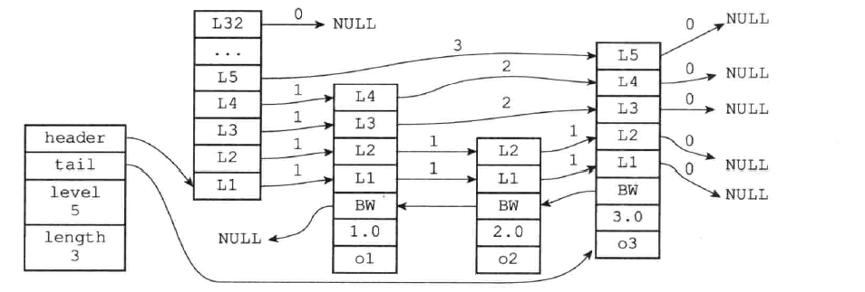

[toc]

# 跳表

跳表(skiplist)是一种有序数据结构，他通过在每个节点中维持多个指向其他节点的指针，从而达到快速访问节点的目的。[跳表的详细定义请看另一篇笔记](./跳表.md)

## 跳表的实现

Redis的跳表由`zskiplistNode`和`zskiplist`两个结构定义，其中`zskiplistNode`表示跳跃节点，而`zskiplist`结构这用于保存跳跃节点相关的信息。

```c
typedef struct zskiplist {

    // 表头节点和表尾节点
    struct zskiplistNode *header, *tail;

    // 表中节点的数量
    unsigned long length;

    // 表中层数最大的节点的层数
    int level;

} zskiplist;
/*
 * 跳跃表节点
 */
typedef struct zskiplistNode {

    // 成员对象
    robj *obj;

    // 分值
    double score;

    // 后退指针
    struct zskiplistNode *backward;

    // 层
    struct zskiplistLevel {

        // 前进指针
        struct zskiplistNode *forward;

        // 跨度
        unsigned int span;

    } level[];

} zskiplistNode;

typedef struct redisObject {

    // 类型
    unsigned type:4;

    // 编码
    unsigned encoding:4;

    // 对象最后一次被访问的时间
    unsigned lru:REDIS_LRU_BITS; /* lru time (relative to server.lruclock) */

    // 引用计数
    int refcount;

    // 指向实际值的指针
    void *ptr;

} robj;
```



如图所示：

`zskiplist`结构：

- `header`:指向跳表的头结点。
- `tail`：指向跳表的表尾节点。
- `level`：记录跳表内，层数最大的那个节点的层数（表头节点不算在内）。
- `length`：记录跳表的长度，也即是，跳表目前包含的节点的数量（表头节点不包含在内）。

`zskiplistNode`结构：

- `level`层：图中每个节点用`L1`,`L2`,`L3`等字样来标记各个层，`L1`代表的是第一层，一次类推。每个层都带有两个属性：前进指针`*forward`和跨度`span`。前进指针用于访问位于表尾方向的节点，而跨度则记录了前进指针所指向节点和当前节点的距离。
- `backward`后退指针：图中节点用BW字样标记节点的后腿指针，它指向位于当前节点的前一个节点。
- `score`分值：图中节点1.0,2.0等都是节点保存的分值。这些分值从小到大进行排序。
- `obj`成员对象：各个节点保存的成员对象。

## 跳表的创建

```c
#define ZSKIPLIST_MAXLEVEL 32 /* Should be enough for 2^32 elements */
/*
 * 创建并返回一个新的跳跃表
 *
 * T = O(1)
 */
zskiplist *zslCreate(void) {
    int j;
    zskiplist *zsl;

    // 分配空间
    zsl = zmalloc(sizeof(*zsl));

    // 设置高度和起始层数
    zsl->level = 1;//不包含表头结点的层数
    zsl->length = 0;

    // 初始化表头节点
    // T = O(1)
    zsl->header = zslCreateNode(ZSKIPLIST_MAXLEVEL,0,NULL);
    for (j = 0; j < ZSKIPLIST_MAXLEVEL; j++) {
        zsl->header->level[j].forward = NULL; // 前进指针为空
        zsl->header->level[j].span = 0;    // 跨度为0
    }
    zsl->header->backward = NULL;

    // 设置表尾
    zsl->tail = NULL;

    return zsl;
}
/*
 * 创建一个层数为 level 的跳跃表节点，
 * 并将节点的成员对象设置为 obj ，分值设置为 score 。
 *
 * 返回值为新创建的跳跃表节点
 *
 * T = O(1)
 */
zskiplistNode *zslCreateNode(int level, double score, robj *obj) {
    
    //分配空间,创建的大小为sizeof(zskiplistNode) + sizeof(最大层高(这里为32)*层的大小) 
    zskiplistNode *zn = zmalloc(sizeof(*zn)+level*sizeof(struct zskiplistLevel));

    // 设置属性
    zn->score = score;
    zn->obj = obj;

    return zn;
}
```


## 跳表的插入

```c
#define redisAssert(_e) ((_e)?(void)0 : (_redisAssert(#_e,__FILE__,__LINE__),_exit(1)))
/*
 * 创建一个成员为 obj ，分值为 score 的新节点，
 * 并将这个新节点插入到跳跃表 zsl 中。
 * 
 * 函数的返回值为新节点。
 *
 * T_wrost = O(N^2), T_avg = O(N log N)
 */
zskiplistNode *zslInsert(zskiplist *zsl, double score, robj *obj) {
    zskiplistNode *update[ZSKIPLIST_MAXLEVEL], *x;
    unsigned int rank[ZSKIPLIST_MAXLEVEL]; 
    int i, level;

    redisAssert(!isnan(score));

    // 在各个层查找节点的插入位置
    // T_wrost = O(N^2), T_avg = O(N log N)
    x = zsl->header;
    for (i = zsl->level-1; i >= 0; i--) {
        // 如果 i 不是 zsl->level-1 层
        // 那么 i 层的起始 rank 值为 i+1 层的 rank 值
        // 各个层的 rank 值一层层累积
        // 最终 rank[0] 的值加一就是新节点的前置节点的排位
        // rank[0] 会在后面成为计算 span 值和 rank 值的基础
        
        // 如果i的值为zsl->level-1则rank[i]的值为0，否则为rank[i+1].
        rank[i] = i == (zsl->level-1) ? 0 : rank[i+1];

        // 沿着前进指针遍历跳跃表
        // T_wrost = O(N^2), T_avg = O(N log N)
        while (x->level[i].forward &&  //如果前进指针不为空（已经到尽头了）
               // 如果前面节点的分小于要插入的score
            (x->level[i].forward->score < score ||
                // 如果前面节点的分等于于要插入的score，且与要插入的值不匹配，那么继续前进遍历。
                (x->level[i].forward->score == score &&
                compareStringObjects(x->level[i].forward->obj,obj) < 0))) {

            // 记录沿途跨越了多少个节点
            rank[i] += x->level[i].span;

            // 移动至下一指针
            x = x->level[i].forward;
        }
        // 记录将要和新节点相连接的节点
        update[i] = x;
    }

    /* 
     * zslInsert() 的调用者会确保同分值且同成员的元素不会出现，
     * 所以这里不需要进一步进行检查，可以直接创建新元素。
     */

    // 获取一个随机值作为新节点的层数
    // T = O(N)
    level = zslRandomLevel();

    // 如果新节点的层数比表中其他节点的层数都要大
    // 那么初始化表头节点中未使用的层，并将它们记录到 update 数组中
    // 将来也指向新节点
    if (level > zsl->level) {

        // 初始化未使用层
        // T = O(1)
        for (i = zsl->level; i < level; i++) {
            rank[i] = 0;
            update[i] = zsl->header;
            update[i]->level[i].span = zsl->length;
        }

        // 更新表中节点最大层数
        zsl->level = level;
    }

    // 创建新节点
    x = zslCreateNode(level,score,obj);

    // 将前面记录的指针指向新节点，并做相应的设置
    // T = O(1)
    for (i = 0; i < level; i++) {
        
        // 设置新节点的 forward 指针
        x->level[i].forward = update[i]->level[i].forward;
        
        // 将沿途记录的各个节点的 forward 指针指向新节点
        update[i]->level[i].forward = x;

        /* update span covered by update[i] as x is inserted here */
        // 计算新节点跨越的节点数量
        x->level[i].span = update[i]->level[i].span - (rank[0] - rank[i]);

        // 更新新节点插入之后，沿途节点的 span 值
        // 其中的 +1 计算的是新节点
        update[i]->level[i].span = (rank[0] - rank[i]) + 1;
    }

    /* increment span for untouched levels */
    // 未接触的节点的 span 值也需要增一，这些节点直接从表头指向新节点
    // T = O(1)
    for (i = level; i < zsl->level; i++) {
        update[i]->level[i].span++;
    }

    // 设置新节点的后退指针
    x->backward = (update[0] == zsl->header) ? NULL : update[0];
    if (x->level[0].forward)
        x->level[0].forward->backward = x;
    else
        zsl->tail = x;

    // 跳跃表的节点计数增一
    zsl->length++;

    return x;
}

/* 
 * 返回一个随机值，用作新跳跃表节点的层数。
 *
 * 返回值介乎 1 和 ZSKIPLIST_MAXLEVEL 之间（包含 ZSKIPLIST_MAXLEVEL），
 * 根据随机算法所使用的幂次定律，越大的值生成的几率越小。
 *
 * T = O(N)
 */
int zslRandomLevel(void) {
    int level = 1;

    while ((random()&0xFFFF) < (ZSKIPLIST_P * 0xFFFF))
        level += 1;

    return (level<ZSKIPLIST_MAXLEVEL) ? level : ZSKIPLIST_MAXLEVEL;
}
```

TODO:这段代码有点复杂，能看懂，最好是画个图来辅助理解。


## 跳表的删除

```c
/*
 * 从跳跃表 zsl 中删除包含给定节点 score 并且带有指定对象 obj 的节点。
 *
 * T_wrost = O(N^2), T_avg = O(N log N)
 */
int zslDelete(zskiplist *zsl, double score, robj *obj) {
    zskiplistNode *update[ZSKIPLIST_MAXLEVEL], *x;
    int i;

    // 遍历跳跃表，查找目标节点，并记录所有沿途节点
    // T_wrost = O(N^2), T_avg = O(N log N)
    x = zsl->header;
    for (i = zsl->level-1; i >= 0; i--) {

        // 遍历跳跃表的复杂度为 T_wrost = O(N), T_avg = O(log N)
        while (x->level[i].forward &&
            (x->level[i].forward->score < score ||
                // 比对分值
                (x->level[i].forward->score == score &&
                // 比对对象，T = O(N)
                compareStringObjects(x->level[i].forward->obj,obj) < 0)))

            // 沿着前进指针移动
            x = x->level[i].forward;

        // 记录沿途节点
        update[i] = x;
    }

    /*
     * 检查找到的元素 x ，只有在它的分值和对象都相同时，才将它删除。
     */
    x = x->level[0].forward;
    if (x && score == x->score && equalStringObjects(x->obj,obj)) {
        // T = O(1)
        zslDeleteNode(zsl, x, update);
        // T = O(1)
        zslFreeNode(x);
        return 1;
    } else {
        return 0; /* not found */
    }

    return 0; /* not found */
}

/* 
 * 内部删除函数，
 * 被 zslDelete 、 zslDeleteRangeByScore 和 zslDeleteByRank 等函数调用。
 *
 * T = O(1)
 */
void zslDeleteNode(zskiplist *zsl, zskiplistNode *x, zskiplistNode **update) {
    int i;

    // 更新所有和被删除节点 x 有关的节点的指针，解除它们之间的关系
    // T = O(1)
    for (i = 0; i < zsl->level; i++) {
        if (update[i]->level[i].forward == x) {
            update[i]->level[i].span += x->level[i].span - 1;
            update[i]->level[i].forward = x->level[i].forward;
        } else {
            update[i]->level[i].span -= 1;
        }
    }

    // 更新被删除节点 x 的前进和后退指针
    if (x->level[0].forward) {
        x->level[0].forward->backward = x->backward;
    } else {
        zsl->tail = x->backward;
    }

    // 更新跳跃表最大层数（只在被删除节点是跳跃表中最高的节点时才执行）
    // T = O(1)
    while(zsl->level > 1 && zsl->header->level[zsl->level-1].forward == NULL)
        zsl->level--;

    // 跳跃表节点计数器减一
    zsl->length--;
}
```


## 跳表查找分值

```c
/* 
 *
 * 查找包含给定分值和成员对象的节点在跳跃表中的排位。
 *
 *
 * 如果没有包含给定分值和成员对象的节点，返回 0 ，否则返回排位。
 *
 *
 * 注意，因为跳跃表的表头也被计算在内，所以返回的排位以 1 为起始值。
 *
 * T_wrost = O(N), T_avg = O(log N)
 */
unsigned long zslGetRank(zskiplist *zsl, double score, robj *o) {
    zskiplistNode *x;
    unsigned long rank = 0;
    int i;

    // 遍历整个跳跃表
    x = zsl->header;
    for (i = zsl->level-1; i >= 0; i--) {

        // 遍历节点并对比元素
        while (x->level[i].forward &&
            (x->level[i].forward->score < score ||
                // 比对分值
                (x->level[i].forward->score == score &&
                // 比对成员对象
                compareStringObjects(x->level[i].forward->obj,o) <= 0))) {

            // 累积跨越的节点数量
            rank += x->level[i].span;

            // 沿着前进指针遍历跳跃表
            x = x->level[i].forward;
        }

        /* x might be equal to zsl->header, so test if obj is non-NULL */
        // 必须确保不仅分值相等，而且成员对象也要相等
        // T = O(N)
        if (x->obj && equalStringObjects(x->obj,o)) {
            return rank;
        }
    }

    // 没找到
    return 0;
}
```

