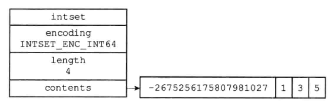
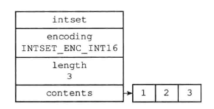
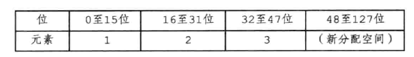
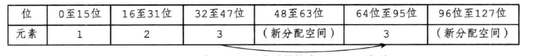
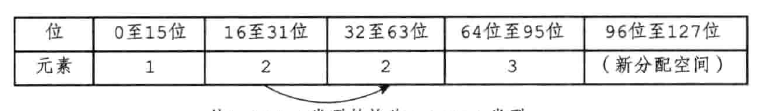
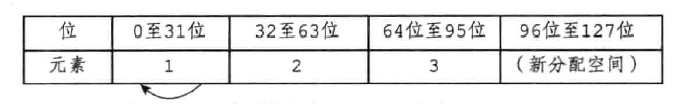
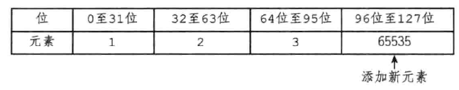
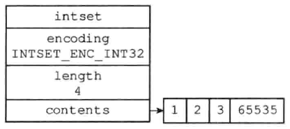

# 整数集合

整数集合是集合键的底层实现之一 ，当一个集合只包含整数值元素，并且这个自己的元素数量不多时，Redis 就会使用整数集合作为集合键的底层实现。

它用来保存整数值的集合抽象数据结构，它可以保存类型为`int16_t` 、 `int32_t` 或者 `int64_t` 的整数值，并且不会出现重复的元素。

## 整数集合的实现


```c
typedef struct intset {
    
    // 编码方式
    uint32_t encoding;

    // 集合包含的元素数量
    uint32_t length;

    // 保存元素的数组
    int8_t contents[];

} intset;
```

- ` contents`  : `contents` 数组是整数集合的底层实现：整数集合的每个元素都是 `contents`  数组的一个数据项( item ), 各个项在数组中按置的大小从小到大有序排列，并且数组中不包含任何重复项。

- `length` ：`length` 属性记录了整数集合包含的元数数量，也就是 `contents` 数组的长度。

- `encoding` :  虽然 `contents` 数组是 `int8_t` 类型的，但实际上 `contents` 数组并不保存任何 `int8_t` 类型的值， `contents` 数组真正的类型取决于 `encoding` 的值：

  | encoding值         | contents值，以及类型                                         |
  | ------------------ | ------------------------------------------------------------ |
  | `INTSET_ENC_INT16` | `contents` 数组为 `int16_t` 的数组，数组里的每个项都是一个 `int16_t` 类型的整数值（最小值为-32768，最大值为32768） |
  | `INTSET_ENC_INT32` | `contents` 数组为 `int32_t` 的数组，数组里的每个项都是一个 `int32_t` 类型的整数值（最小值为-2147483648，最大值为2147483648） |
  | `INTSET_ENC_INT64` | `contents` 数组为 `int64_t` 的数组，数组里的每个项都是一个 `int64_t` 类型的整数值（最小值为-9223372036854775808，最大值为9223372036854775808） |

###  整数集合示例



如图所示：

- `encoding` 属性值为 `INTSET_ENC_INT64`  表示整数集合的底层实现为 `int64_t` 类型的数组，而数组中保存的都是 `int64_t` 类型的整数值。
- `length` 属性的值为4，表示整数集合包含4个元素。
- 因为每个集合元素都是 `int64_t` 类型的整数值，所以 `contents` 数组的大小为 `sizeof(int64_t) * 4 = 64 *4 = 256位`

```c
/* 
 * 创建并返回一个新的空整数集合
 *
 * T = O(1)
 */
intset *intsetNew(void) {

    // 为整数集合结构分配空间
    intset *is = zmalloc(sizeof(intset));

    // 设置初始编码
    is->encoding = intrev32ifbe(INTSET_ENC_INT16);

    // 初始化元素数量
    is->length = 0;

    return is;
}

/* 在集合 is 的底层数组中查找值 value 所在的索引。
 *
 * 成功找到 value 时，函数返回 1 ，并将 *pos 的值设为 value 所在的索引。
 *
 * 当在数组中没找到 value 时，返回 0 。
 * 并将 *pos 的值设为 value 可以插入到数组中的位置。
 *
 * T = O(log N)
 */
static uint8_t intsetSearch(intset *is, int64_t value, uint32_t *pos) {
    int min = 0, max = intrev32ifbe(is->length)-1, mid = -1;
    int64_t cur = -1;

    /* The value can never be found when the set is empty */
    // 处理 is 为空时的情况
    if (intrev32ifbe(is->length) == 0) {
        if (pos) *pos = 0;
        return 0;
    } else {
        // 因为底层数组是有序的，如果 value 比数组中最后一个值都要大
        // 那么 value 肯定不存在于集合中，
        // 并且应该将 value 添加到底层数组的最末端
        if (value > _intsetGet(is,intrev32ifbe(is->length)-1)) {
            if (pos) *pos = intrev32ifbe(is->length);
            return 0;
        // 因为底层数组是有序的，如果 value 比数组中最前一个值都要小
        // 那么 value 肯定不存在于集合中，
        // 并且应该将它添加到底层数组的最前端
        } else if (value < _intsetGet(is,0)) {
            if (pos) *pos = 0;
            return 0;
        }
    }

    // 在有序数组中进行二分查找
    // T = O(log N)
    while(max >= min) {
        mid = (min+max)/2;
        cur = _intsetGet(is,mid);
        if (value > cur) {
            min = mid+1;
        } else if (value < cur) {
            max = mid-1;
        } else {
            break;
        }
    }

    // 检查是否已经找到了 value
    if (value == cur) {
        if (pos) *pos = mid;
        return 1;
    } else {
        if (pos) *pos = min;
        return 0;
    }
}

/* 根据集合的编码方式，返回底层数组在 pos 索引上的值
 *
 * T = O(1)
 */
static int64_t _intsetGet(intset *is, int pos) {
    return _intsetGetEncoded(is,pos,intrev32ifbe(is->encoding));
}

/* 根据给定的编码方式 enc ，返回集合的底层数组在 pos 索引上的元素。
 *
 * T = O(1)
 */
static int64_t _intsetGetEncoded(intset *is, int pos, uint8_t enc) {
    int64_t v64;
    int32_t v32;
    int16_t v16;

    // ((ENCODING*)is->contents) 首先将数组转换回被编码的类型
    // 然后 ((ENCODING*)is->contents)+pos 计算出元素在数组中的正确位置
    // 之后 member(&vEnc, ..., sizeof(vEnc)) 再从数组中拷贝出正确数量的字节
    // 如果有需要的话， memrevEncifbe(&vEnc) 会对拷贝出的字节进行大小端转换
    // 最后将值返回
    if (enc == INTSET_ENC_INT64) {
        memcpy(&v64,((int64_t*)is->contents)+pos,sizeof(v64));
        memrev64ifbe(&v64);
        return v64;
    } else if (enc == INTSET_ENC_INT32) {
        memcpy(&v32,((int32_t*)is->contents)+pos,sizeof(v32));
        memrev32ifbe(&v32);
        return v32;
    } else {
        memcpy(&v16,((int16_t*)is->contents)+pos,sizeof(v16));
        memrev16ifbe(&v16);
        return v16;
    }
}


/* 
 * 尝试将元素 value 添加到整数集合中。
 *
 * *success 的值指示添加是否成功：
 * - 如果添加成功，那么将 *success 的值设为 1 。
 * - 因为元素已存在而造成添加失败时，将 *success 的值设为 0 。
 *
 * T = O(N)
 */
intset *intsetAdd(intset *is, int64_t value, uint8_t *success) {

    // 计算编码 value 所需的长度
    uint8_t valenc = _intsetValueEncoding(value);
    uint32_t pos;

    // 默认设置插入为成功
    if (success) *success = 1;

    // 如果 value 的编码比整数集合现在的编码要大
    // 那么表示 value 必然可以添加到整数集合中
    // 并且整数集合需要对自身进行升级，才能满足 value 所需的编码
    if (valenc > intrev32ifbe(is->encoding)) {
        // T = O(N)
        return intsetUpgradeAndAdd(is,value);
    } else {
        // 运行到这里，表示整数集合现有的编码方式适用于 value
        // 在整数集合中查找 value ，看他是否存在：
        // - 如果存在，那么将 *success 设置为 0 ，并返回未经改动的整数集合
        // - 如果不存在，那么可以插入 value 的位置将被保存到 pos 指针中
        //   等待后续程序使用
        if (intsetSearch(is,value,&pos)) {
            if (success) *success = 0;
            return is;
        }

        // 运行到这里，表示 value 不存在于集合中
        // 程序需要将 value 添加到整数集合中
    
        // 为 value 在集合中分配空间
        is = intsetResize(is,intrev32ifbe(is->length)+1);
        // 如果新元素不是被添加到底层数组的末尾
        // 那么需要对现有元素的数据进行移动，空出 pos 上的位置，用于设置新值
        // 举个例子
        // 如果数组为：
        // | x | y | z | ? |
        //     |<----->|
        // 而新元素 n 的 pos 为 1 ，那么数组将移动 y 和 z 两个元素
        // | x | y | y | z |
        //         |<----->|
        // 这样就可以将新元素设置到 pos 上了：
        // | x | n | y | z |
        // T = O(N)
        if (pos < intrev32ifbe(is->length)) intsetMoveTail(is,pos,pos+1);
    }

    // 将新值设置到底层数组的指定位置中
    _intsetSet(is,pos,value);

    // 增一集合元素数量的计数器
    is->length = intrev32ifbe(intrev32ifbe(is->length)+1);

    // 返回添加新元素后的整数集合
    return is;

    /* p.s. 上面的代码可以重构成以下更简单的形式：
    
    if (valenc > intrev32ifbe(is->encoding)) {
        return intsetUpgradeAndAdd(is,value);
    }
     
    if (intsetSearch(is,value,&pos)) {
        if (success) *success = 0;
        return is;
    } else {
        is = intsetResize(is,intrev32ifbe(is->length)+1);
        if (pos < intrev32ifbe(is->length)) intsetMoveTail(is,pos,pos+1);
        _intsetSet(is,pos,value);

        is->length = intrev32ifbe(intrev32ifbe(is->length)+1);
        return is;
    }
    */
}
```


## 升级

每当我们要讲一个新元素添加到整数集合里面，并且新元素的类型比整数集合的所有元素的类型都要长时，整数集合需要先进行升级(upgrade)，然后才能将新元素添加到整数集合里面。

升级整数集合并添加新元素共分为三步进行：

1. 根据新元素的类型，扩展整数集合底层数组的空间大小，并为新元素分配空间。
2. 将底层数组现有的所有元素都转换为与新元素相同的类型，并将类型转换后的元素放在正确的位置上，而且在放置元素的过程中，需要维持底层的数组有序性质不变。
3. 将新元素添加到底层数组里面。


 如图所示：



现在有个 `INTSET_ENC_INT16`  编码的整数集合，集合中包含三个 `int16` 的元素。每个元素占16位空间，所以底层数组的大小为3*16=48位，现在我们要将类型为 `int32_t` 的整数值 65535添加到整数集合里面，由于 65535 的类型 `int32_t` 比整数集合当前所有元素的类型都要长，所以，要将65535添加到整数集合之前，程序需要先对整数集合进行升级。

升级首先要做的是，根据新类型的长度，以及集合元素的数量（包括有要添加的新元素在内），对底层数组进行空间重分配。

目前，新增加的元素为 `int32_t` 类型的，需要每个占32位空间，所以在空间重新分配之后，底层数组的大小将是 `32 * 4 =128`。

如图所示：



首先要移动最靠近新分配空间的元素，如下图所示。



然后以此类推，移动2.



 之后移动1。



然后将，65535插入到新分配的空间里



最后将 `encoding` 属性值改为 `INTSET_ENC_INT32`  ,并将 `length` 属性值改为4，如图所示，就完成了。



>有个地方要注意一下，升级元素摆放的位置
>
>要因为要引发升级的元素长度总是比整数集合现有所有元素的长度都大，所以这个新元素的值要么就大于所有现有元素，要么就小于所有现有元素（例如，之前插入的是65535，比所有元素都要大，如果插入的是 -65535 则比所有的都要小）
>
>如果新元素小于所有现有元素的情况下，新元素会被放置在底层数组的最开头（索引0）；
>
>如果新元素大于所有现有元素的情况下，新元素会被放置在底层数组的最末尾(索引length - 1)


```c
/*
 * 向前或先后移动指定索引范围内的数组元素
 *
 * 函数名中的 MoveTail 其实是一个有误导性的名字，
 * 这个函数可以向前或向后移动元素，
 * 而不仅仅是向后
 *
 * 在添加新元素到数组时，就需要进行向后移动，
 * 如果数组表示如下（？表示一个未设置新值的空间）：
 * | x | y | z | ? |
 *     |<----->|
 * 而新元素 n 的 pos 为 1 ，那么数组将移动 y 和 z 两个元素
 * | x | y | y | z |
 *         |<----->|
 * 接着就可以将新元素 n 设置到 pos 上了：
 * | x | n | y | z |
 *
 * 当从数组中删除元素时，就需要进行向前移动，
 * 如果数组表示如下，并且 b 为要删除的目标：
 * | a | b | c | d |
 *         |<----->|
 * 那么程序就会移动 b 后的所有元素向前一个元素的位置，
 * 从而覆盖 b 的数据：
 * | a | c | d | d |
 *     |<----->|
 * 最后，程序再从数组末尾删除一个元素的空间：
 * | a | c | d |
 * 这样就完成了删除操作。
 *
 * T = O(N)
 */
static void intsetMoveTail(intset *is, uint32_t from, uint32_t to) {

    void *src, *dst;

    // 要移动的元素个数
    uint32_t bytes = intrev32ifbe(is->length)-from;

    // 集合的编码方式
    uint32_t encoding = intrev32ifbe(is->encoding);

    // 根据不同的编码
    // src = (Enc_t*)is->contents+from 记录移动开始的位置
    // dst = (Enc_t*)is_.contents+to 记录移动结束的位置
    // bytes *= sizeof(Enc_t) 计算一共要移动多少字节
    if (encoding == INTSET_ENC_INT64) {
        src = (int64_t*)is->contents+from;
        dst = (int64_t*)is->contents+to;
        bytes *= sizeof(int64_t);
    } else if (encoding == INTSET_ENC_INT32) {
        src = (int32_t*)is->contents+from;
        dst = (int32_t*)is->contents+to;
        bytes *= sizeof(int32_t);
    } else {
        src = (int16_t*)is->contents+from;
        dst = (int16_t*)is->contents+to;
        bytes *= sizeof(int16_t);
    }

    // 进行移动
    // T = O(N)
    memmove(dst,src,bytes);
}

/* 尝试将元素 value 添加到整数集合中。
 *
 * *success 的值指示添加是否成功：
 * - 如果添加成功，那么将 *success 的值设为 1 。
 * - 因为元素已存在而造成添加失败时，将 *success 的值设为 0 。
 *
 * T = O(N)
 */
intset *intsetAdd(intset *is, int64_t value, uint8_t *success) {

    // 计算编码 value 所需的长度
    uint8_t valenc = _intsetValueEncoding(value);
    uint32_t pos;

    // 默认设置插入为成功
    if (success) *success = 1;
    
    // 如果 value 的编码比整数集合现在的编码要大
    // 那么表示 value 必然可以添加到整数集合中
    // 并且整数集合需要对自身进行升级，才能满足 value 所需的编码
    if (valenc > intrev32ifbe(is->encoding)) {
        /* This always succeeds, so we don't need to curry *success. */
        // T = O(N)
        return intsetUpgradeAndAdd(is,value);
    } else {
        // 运行到这里，表示整数集合现有的编码方式适用于 value
        // 在整数集合中查找 value ，看他是否存在：
        // - 如果存在，那么将 *success 设置为 0 ，并返回未经改动的整数集合
        // - 如果不存在，那么可以插入 value 的位置将被保存到 pos 指针中
        //   等待后续程序使用
        if (intsetSearch(is,value,&pos)) {
            if (success) *success = 0;
            return is;
        }

        // 运行到这里，表示 value 不存在于集合中
        // 程序需要将 value 添加到整数集合中
    
        // 为 value 在集合中分配空间
        is = intsetResize(is,intrev32ifbe(is->length)+1);
        // 如果新元素不是被添加到底层数组的末尾
        // 那么需要对现有元素的数据进行移动，空出 pos 上的位置，用于设置新值
        // 举个例子
        // 如果数组为：
        // | x | y | z | ? |
        //     |<----->|
        // 而新元素 n 的 pos 为 1 ，那么数组将移动 y 和 z 两个元素
        // | x | y | y | z |
        //         |<----->|
        // 这样就可以将新元素设置到 pos 上了：
        // | x | n | y | z |
        // T = O(N)
        if (pos < intrev32ifbe(is->length)) intsetMoveTail(is,pos,pos+1);
    }

    // 将新值设置到底层数组的指定位置中
    _intsetSet(is,pos,value);

    // 增一集合元素数量的计数器
    is->length = intrev32ifbe(intrev32ifbe(is->length)+1);

    // 返回添加新元素后的整数集合
    return is;

    /* p.s. 上面的代码可以重构成以下更简单的形式：
    
    if (valenc > intrev32ifbe(is->encoding)) {
        return intsetUpgradeAndAdd(is,value);
    }
     
    if (intsetSearch(is,value,&pos)) {
        if (success) *success = 0;
        return is;
    } else {
        is = intsetResize(is,intrev32ifbe(is->length)+1);
        if (pos < intrev32ifbe(is->length)) intsetMoveTail(is,pos,pos+1);
        _intsetSet(is,pos,value);

        is->length = intrev32ifbe(intrev32ifbe(is->length)+1);
        return is;
    }
    */
}

/* 根据值 value 所使用的编码方式，对整数集合的编码进行升级，
 * 并将值 value 添加到升级后的整数集合中。
 *
 * 返回值：添加新元素之后的整数集合
 *
 * T = O(N)
 */
static intset *intsetUpgradeAndAdd(intset *is, int64_t value) {
    
    // 当前的编码方式
    uint8_t curenc = intrev32ifbe(is->encoding);

    // 新值所需的编码方式
    uint8_t newenc = _intsetValueEncoding(value);

    // 当前集合的元素数量
    int length = intrev32ifbe(is->length);

    // 根据 value 的值，决定是将它添加到底层数组的最前端还是最后端
    // 注意，因为 value 的编码比集合原有的其他元素的编码都要大
    // 所以 value 要么大于集合中的所有元素，要么小于集合中的所有元素
    // 因此，value 只能添加到底层数组的最前端或最后端
    int prepend = value < 0 ? 1 : 0;

    /* First set new encoding and resize */
    // 更新集合的编码方式
    is->encoding = intrev32ifbe(newenc);
    // 根据新编码对集合（的底层数组）进行空间调整
    // T = O(N)
    is = intsetResize(is,intrev32ifbe(is->length)+1);

    // 根据集合原来的编码方式，从底层数组中取出集合元素
    // 然后再将元素以新编码的方式添加到集合中
    // 当完成了这个步骤之后，集合中所有原有的元素就完成了从旧编码到新编码的转换
    // 因为新分配的空间都放在数组的后端，所以程序先从后端向前端移动元素
    // 举个例子，假设原来有 curenc 编码的三个元素，它们在数组中排列如下：
    // | x | y | z | 
    // 当程序对数组进行重分配之后，数组就被扩容了（符号 ？ 表示未使用的内存）：
    // | x | y | z | ? |   ?   |   ?   |
    // 这时程序从数组后端开始，重新插入元素：
    // | x | y | z | ? |   z   |   ?   |
    // | x | y |   y   |   z   |   ?   |
    // |   x   |   y   |   z   |   ?   |
    // 最后，程序可以将新元素添加到最后 ？ 号标示的位置中：
    // |   x   |   y   |   z   |  new  |
    // 上面演示的是新元素比原来的所有元素都大的情况，也即是 prepend == 0
    // 当新元素比原来的所有元素都小时（prepend == 1），调整的过程如下：
    // | x | y | z | ? |   ?   |   ?   |
    // | x | y | z | ? |   ?   |   z   |
    // | x | y | z | ? |   y   |   z   |
    // | x | y |   x   |   y   |   z   |
    // 当添加新值时，原本的 | x | y | 的数据将被新值代替
    // |  new  |   x   |   y   |   z   |
    // T = O(N)
    while(length--)
        _intsetSet(is,length+prepend,_intsetGetEncoded(is,length,curenc));

    /* Set the value at the beginning or the end. */
    // 设置新值，根据 prepend 的值来决定是添加到数组头还是数组尾
    if (prepend)
        _intsetSet(is,0,value);
    else
        _intsetSet(is,intrev32ifbe(is->length),value);

    // 更新整数集合的元素数量
    is->length = intrev32ifbe(intrev32ifbe(is->length)+1);

    return is;
}
```


### 升级的好处

提升灵活性，节约内存。


## 降级

暂时不支持降级。

